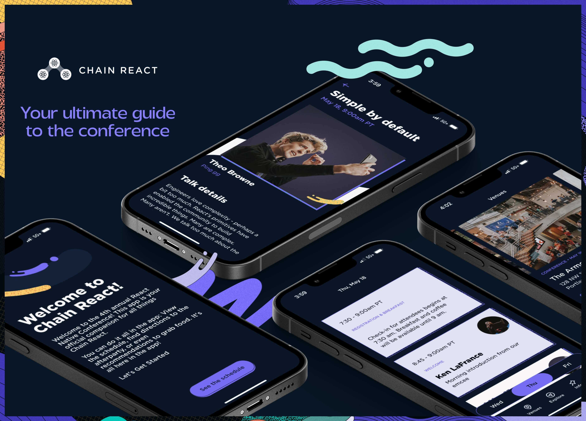

# The official App for #ChainReact2023

Coming soon! This will be the home for the app for [Chain React 2023](https://cr.infinite.red/), the only React Native focused conference in the USA, hosted by [Infinite Red](https://infinite.red/). Stay tuned for updates ❤️ ⚛

<br />

# Download the App

[](https://apps.apple.com/us/app/chain-react-conf/id1239112816) [](https://play.google.com/store/apps/details?id=com.chainreactapp)

# Building app

## Pre-reqs

1. `brew install fastlane`
2. `npm install -g eas-cli` or `yarn global add eas-cli` (v3.1.1 is the latest as of this edit)

Note: The steps below will have to be run when either of the following happen:

1. Fresh app checkout
2. After pulling `main`, and either `package.json`, `app.json`, or `eas.json` files have updates

## iOS Simulator

1. `yarn build:local:ios`
2. double click newly created `*.tar.gz` file in `build\` directory of project
3. you'll now see a `ChainReactApp2023.app` file in the root of your project > drag and drop this file to your simulator
4. `yarn start`
5. `i` > app should now open and build

## Android Emulator

1. `yarn build:local:android`
2. APK will be generated in the `build\` directory of the project
3. Drag and drop this file to your emulator or sideload to Android device of choice
4. `yarn start`
5. `a` > app will open on the emulator or connected device (use `adb devices` to see if properly connected)

## Running on devices

In order to run on an iOS device, you'll need to add your device to EAS.

1. Run `eas device:create` and follow the prompts.
2. Enter your UDID or use the web URL option
3. Make sure to give the device a descriptive name (e.g. Jamon's iPhone 12)

### Development mode

Great for developing on device for testing features like screenreader support

#### Android

1. Follow emulator directions above
2. Instead of dragging build to emulator, use `adb install` to install on connected device

#### iOS

1. Run `yarn build:dev:device`
2. Select iOS (you don't need to run the build through EAS server for Android, just follow the steps above)
3. Make sure your device is included in the provisioning profile when asked.
4. Wait for EAS build to complete. Find you build at https://expo.dev/accounts/infinitered/projects/ChainReactApp2023/builds
5. Install via QR Code
6. Run `yarn start` in your terminal.
7. Scan the QR code that comes up in the terminal output with your device. This should connect your phone app installation to the metro server running on your computer.
8. Good to go!

If you'd prefer to do local builds rather than waiting for EAS servers, you can use the local option:

1. Run `yarn build:dev:device:local`
2. Select platform
3. Make sure your device is included in the provisioning provile (you will be prompted for this)
4. Wait for the build to complete and locate it under `/build`.
5. Ensure your device is connected to your machine via USB cable
6. Open XCode (no need to have any particular project open, just the landing screen is fine). Go to 'Window' > 'Devices and Simulators' and select your device.
7. Drag the `.ipa` file from finder into the XCode window onto the "Installed Apps" section.

### Internal Distribution (Release Mode)

This is for distributing the app to internal testers to run on their devices. The app is in release mode, so this isn't ideal for active development

1. Run `yarn build:preview`
2. Choose "All" or a specific platform
3. If iOS or All is chosen, make sure your iOS device is included in the provisioning profile when asked.
4. Wait for EAS build to complete. Find you build at https://expo.dev/accounts/infinitered/projects/ChainReactApp2023/builds
5. Install via QR Code (make sure you don't have any development builds already installed)
6. You're good to go!

## Moving to your own Expo account

If you'd like to fork this repo and use it on your own Expo account to be able to leverage builds on your own devices, you'll need to do the following:

1. [Fork this repo](https://github.com/infinitered/ChainReactApp2023/fork)
2. `yarn install`
3. Head to the `expo.dev` projects dashboard: https://expo.dev/accounts/{username}/projects (Be sure to update `{username}` with your Expo username)
4. Click on `Create a Project`
5. In `/app.config.ts` update the following values from your newly generated project found at https://expo.dev/accounts/{username}/projects/{slug}:
   1. `owner`
   2. `plugins.expo-updates.username` (same as `owner`)
   3. `slug`
   4. `extra.eas.projectId`
   5. `ios.bundleIdentifier` (your Apple Bundle ID)
   6. `android.package` (your Android Package Name)
6. Follow above steps for building app on either simulator/emulator or device on your platform of choice
7. Happy Coding!

# E2E Tests

## Maestro Installation

The easiest way to install Maestro is via homebrew:

```bash
brew install maestro
brew tap facebook/fb
brew install facebook/fb/idb-companion
```

See [Maestro's documentation](https://maestro.mobile.dev/getting-started/installing-maestro) for other installation instructions.

## Run flows

_Flows currently run against an **iOS 15.5** simulator dev client_

1. yarn start
2. In a separate terminal, execute a flow `maestro test .maestro/`

# Publishing updates OTA

## Pre-reqs

- A `preview` or `production` build of the application on a device

## Notes

- Only make JavaScript changes OTA
- Any native code changes, `app.config.ts` or Expo SDK update will require a store publish

## Steps

1. Make the necessary JavaScript changes<br/>
   a. For a `preview` build, this can just be done locally (with uncommitted changes) or from another git branch<br/>
   b. For a `production`, you'll likely be in some release candidate branch or `main` branch after things have been QA'd
2. Create the EAS update branch `eas update --branch [update branch name] --message "info about the update"`
   - _This packages up the current project code and uploads it as a package to EAS as an update_
3. Determine the update channel where the update branch should be applied. By default, any build profile name in `eas.json` is created as a channel in addition to the specified `channel` property
   a. For a `preview` build, you can use the `preview` channel
4. Point the update channel to the specific update branch `eas channel:edit [channel name] --branch [branch name]`
   - _This tells a build on that update channel to now look for updates available on that branch name_
5. Restart the app twice to receive the update (on the first, the app will download any available updates - then apply it on the second)

## Example

There is a `preview` build of version 1.0 out in the wild, lacking a new feature or bug fix.

```bash
git checkout -b feat/my-new-feature
# make some changes to code
git commit -a -m "feature complete"
eas update --branch preview --message "added new feature"
# from a device with the preview build, open the app to grab the update, and reload it to use the new feature
```

## Dev Testing

From an expo-dev-client, you can open the `Extensions` tab and load any published update to QA the package that would be published OTA.
